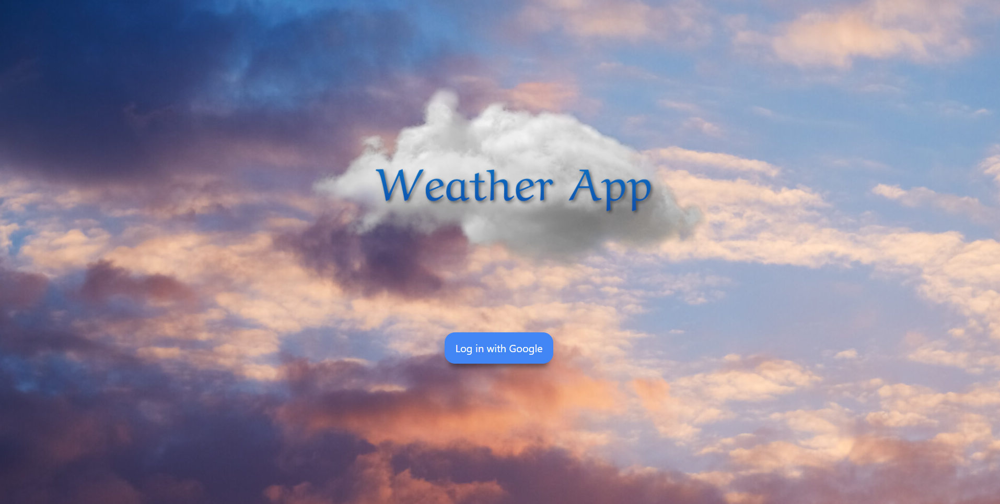
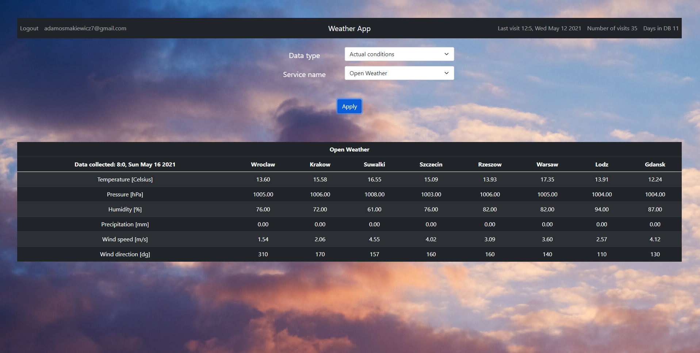
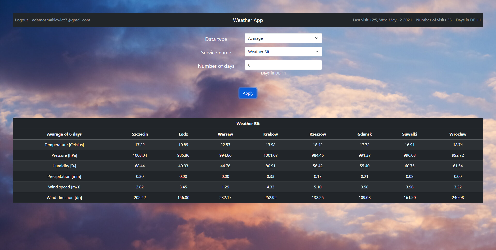
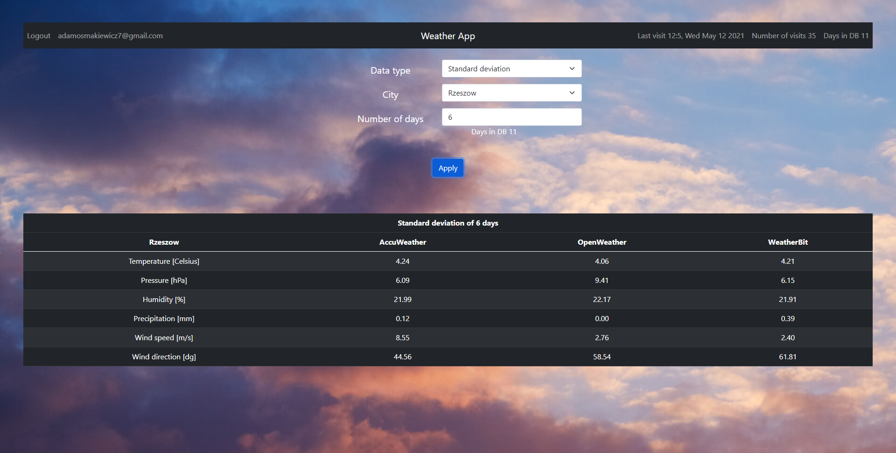

# Weather-web-app
 
 `Nodejs` `PostgreSQL` `Socket.IO`
 
 Web app that collects weather data about 8 cities, every day at 10am and 18pm from 3 different APIs.
 User can see actual conditions, avarage and standard deviation data of the given amount of days.

##                                                           Login page

##                                                           Actual conditions

##                                                           Avarage data

##                                                           Standard deviation 

